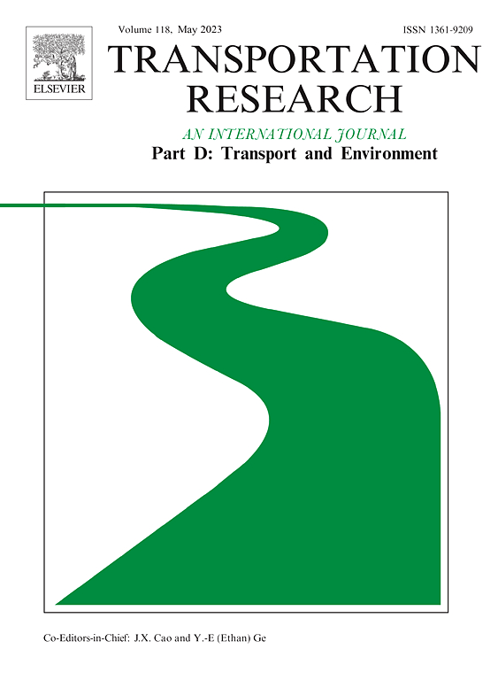

R codes used in the research paper: 

- Vieira, J. P. B., Pereira, R. H. M., & Andrade, P. R. (2023). *Estimating public transport emissions from General Transit Feed Specification data*. **Transportation Research Part D: Transport and Environment**, 119, 103757. [https://doi.org/10.1016/j.trd.2023.103757](https://doi.org/10.1016/j.trd.2023.103757)

The R scripts to reproduce the results are divided into six steps:

 -  `1.0_data-preparation.R`
    - It downloads the [gtfs2emis v. 0.1.0 (Zenodo)](https://zenodo.org/record/7320040#.ZAeL-dLMJEY)
    - Downloads the input data (gtfs of July and October, raster of Sao Paulo city, bus occupancy, vehicle fleet)
 -  `1.1_prep_occupancy_data.R`
    - Preprocess data of urban bus occupancy
 -  `2_core_functions.R`
    - Runs the `transport_model()` and `emission_model()` for gtfs2emis
    - Uses auxiliar functions to estimate emissions by: hour of the day, by grid of Sao Paulo city
    , by age of fleet, by grid and time of the day
    - Saves the main outputs (from `transport_model()` and `emissions_model()`), and pre-processed outputs
    (from `emis_summary()`, `emis_to_dt()` and `emis_grid()` operations)
 -  `3_plots.R`
    - Generates all the plots shown in the research paper
    - Figures is saved in `Figures/`
 -  `4_main_statistics.R`
    - Generate summary tables and specific information for the discussion section
 -  `5_emissions_comparison.R`
    - Compares the emissions from case of study with IEMA 
 -  `6_plots_passenger.R`
    - Generate figures for emissions per urban bus passenger
    

The full article of gtfs2emis can be acessed [Vieira, Pereira and Andrade (2022)](https://doi.org/10.31219/osf.io/8m2cy).
